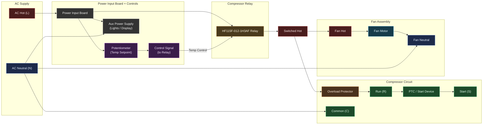

> **Work in Progress — Diagnostic Stage**  
> A serendipitous appliance repair project, learning about refrigerator repair and electronics.
{: .prompt-tip}

I was walking home when I spotted a **Red Bull-branded mini-fridge** abandoned next to the garbage.  
It was dirty, heavy, and almost certainly broken — so obviously I took it home.
I've always wanted one. They are COOL.

  <figure style="flex:1; min-width:280px;">
    
    <figcaption><em>This thing weighs approximately “way too much.”</em></figcaption>
  </figure>
  <figure style="flex:1; min-width:280px;">
    
    <figcaption><em>Data sheet says 95 lbs</em></figcaption>
  </figure>

 
{: .right}
Dragging it inside was… athletic.
I should maybe have rethought my life choices... But I finally found a dolly for the home stretch.

Eventually I got it up the stairs and into the apartment:

---

## First Power Test

When plugged in, nothing happened — bad sign — the **compressor didn’t even try to start**.  
No hum, no click, just silence.

Time for diagnostics.

---

## Opening It Up

The back panel revealed:

- A **compressor** and **fan** (standard fridge guts) 
- A small **relay module** (suspicious)
- A simple **power input board** with **Potentiometer**
- An accessory power brick feeding off the input board. Probably for the front lights

Based on symptoms, my first suspects were:

1. Bad **Starter Relay** and **Overload Protector** (hopefully)
2. Bad **Compressor Relay**
3. Power board traces / input connector
4. The compressor itself (hopefully not)

---

## Wiring Diagram

---

## The Multimeter Comes Out

Compressor Resistance Test:

- The **compressor leads measured normal resistance**  
  (no shorts to ground, no winding imbalance)
- Jumping the relay **started the compressor AND the fan**  
  → meaning the compressor *works*, and the power supply *is fine.* Not option 4.

That narrows it down dramatically.

I decided to swap out the **Starter Relay** and **Overload Protector** mounted to the compressor as these are a common problem, but no such luck. Not option 1.

---

## The Relay: Probably Evil

Here’s the relay the fridge shipped with:

_This is the villain of the story._

Based on the datasheet and what I saw in-circuit:

- Relay does not click
- Zero volts at compressor terminals *through* relay
- But full voltage when jumped around it
- Most importantly: continuity through the coil is **inconsistent**, sometimes briefly non-zero, sometimes nothing  
  → **Dead relay coil** is the most likely failure.

I pulled the part number:

**HF115F-012-1H3AF**  
Common refrigerator compressor relay: cheap, and apparently fragile.

Replacement cost: **$6–$10**.

---

## Current Status

So far, the fridge:

- [x] Powers on (when relay is bypassed)  
- [ ] Lights work  
- [x] Fan works (when relay is bypassed)  
- [x] Compressor *runs* (when relay is bypassed)  
- [ ] Compressor runs under control of the relay  
- [ ] Actually cools my Red Bulls
- [ ] Sold for profit (if my wife hates it). They go for crazy high prices on facebook market and eBay (200-500$)

Based on the tests, I’m now 90% sure the relay is the issue.

New relay is on the way.

---

## Next Steps

- [ ] Replace the HF115F relay  
- [ ] Inspect input board traces for heat damage  
- [x] Clean interior + replace seal  
- [ ] Add thermometer + data logging because why not (may be low-priority but is a fun learning opportunity)
- [ ] Replace missing 'l' on front (currently says "Red Bul")

When the new relay arrives, I’ll post a follow-up to see if this thing becomes a functional fridge… or goes back to the street from whence it came.

---

[← Back to Projects](/projects)

